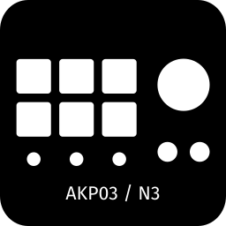

# OpenDeck Ajazz AKP03 / Mirabox N3 Plugin

An unofficial plugin for Mirabox N3-family devices

## OpenDeck version

Requires OpenDeck 2.5.0 or newer

## Supported devices

- Ajazz AKP03 (0300:1001)
- Ajazz AKP03E (0300:3002)
- Ajazz AKP03R (0300:1003)
- Mirabox N3 (6602:1002)
- Mirabox N3EN (6603:1003)
- Soomfon Stream Controller Deck SE (1500:3001)

## Platform support

- Linux: Guaranteed, if stuff breaks - I'll probably catch it before public release
- Mac: Best effort, no tests before release, things may break, but I probably have means to fix them
- Windows: Zero effort, no tests before release, if stuff breaks - too bad, it's up to you to contribute fixes

## Installation

1. Download an archive from [releases](https://github.com/4ndv/opendeck-akp03/releases)
2. In OpenDeck: Plugins -> Install from file
3. Download [udev rules](./40-opendeck-akp03.rules) and install them by copying into `/etc/udev/rules.d/` and running `sudo udevadm control --reload-rules`
4. Unplug and plug again the device, restart OpenDeck

## Adding new devices

Many devices with similar layout and functionality, but different hardware IDs have started popping up over the years. If you have a device that is very similar to the ones already supported, chances are it is very easy to add support for your device too.  
You do not need to delve into much of Rust development to get this up and running. Try the following:

1. Figure out the USB Vendor and Product ID using `lsusb` e.g.: `Bus 003 Device 014: ID 1500:3001 Ellisys HOTSPOTEKUSB HID DEMO`
2. Add your device to `40-opendeck-akp03.rules` (you need to add a total of four new entries)
3. Add an entry to the README and later do a pull request! 
4. Adjust `mapping.rs` for the new hardware
    1. Add your device to the `enum Kind` part in the 
    2. Add the `VID` (Vendor ID) and `PID` (Product ID) 
    3. Add a `QUERY` for your device and add it to the list of `QUERIES`
    4. Match your device to the proper kind in `impl Kind`
    5. Add a human readable name for your device
    6. Add your device to the correct `image_format` match. Try one and see if it needs rotating.
5. Build the rust package as described below
6. Test everything working and add a pull request

## Building

### Prerequisites

You'll need:

- A Linux OS of some sort
- Rust 1.87 and up with `x86_64-unknown-linux-gnu` and `x86_64-pc-windows-gnu` targets installed
- Docker
- [just](https://just.systems)

For arch linux the following commands get everything up and running: 

```sh
sudo pacman -S just mingw-w64-gcc mingw-w64-binutils
rustup target add x86_64-pc-windows-gnu
rustup target add x86_64-unknown-linux-gnu
```

### Preparing environment

```sh
$ just prepare
```

This will build docker image for macOS crosscompilation

### Building a release package

```sh
$ just package
```

## Acknowledgments

This plugin is heavily based on work by contributors of [elgato-streamdeck](https://github.com/streamduck-org/elgato-streamdeck) crate
